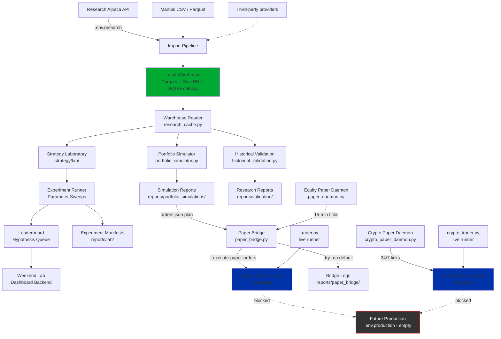

# Architecture

Every subsystem in Trader Joe is designed for one job. Data flows in a
single direction from acquisition through research to (potential)
production. This page documents each subsystem, the modules that
implement it, and how information moves between them.

## System diagram



Solid arrows are wired. Dashed arrows are opt-in or aspirational.
The dark `Future Production` box is deliberately unreachable — no
module reads `.env.production` at the milestone tag.

## Data flow (in words)

1. **Research Alpaca account** or a manual importer publishes bars
   into the local Parquet warehouse.
2. The **DataCatalog** records dataset manifests (symbols, window,
   validation status, sha256 per file, version chain).
3. **Validation** confirms schema and OHLCV invariants; on success
   the manifest flips to `validation_status="validated"`.
4. Research consumers request bars through the **WarehouseReader**,
   which returns warehouse hits when coverage is complete and only
   falls through to providers when explicitly enabled.
5. **HistoricalValidation** replays a Champion / Challenger over a
   window with `DeterministicReplayClock` ordering.
6. **Portfolio Simulator** replays a strategy over a window against
   a paper-sized cash ledger, producing a blotter, equity curve,
   metrics, and a proposed-orders plan.
7. **Strategy Laboratory** — registry, experiment runner, parameter
   sweeps, leaderboard, hypothesis queue — turns simulator/backtest
   evidence into a comparable, rankable artifact set.
8. **Weekend Lab** orchestrates the whole pipeline into a single
   run under `reports/weekend_lab/<run_id>/` with an HTML
   dashboard.
9. **Paper Bridge** consumes a simulator plan (or a research plan
   with the same shape) and, in dry-run, previews the resulting
   paper orders. With `--execute-paper-orders`, it submits.
10. **Equity Paper Daemon** and **Crypto Paper Daemon** wrap the
    bridge in a schedule-aware, cap-enforcing, cooldown-tracking
    tick loop.

## Subsystem detail

### 1. Historical Warehouse

Files:

- `strategy/local_warehouse.py` — filesystem layout, integrity checks,
  atomic manifest writes.
- `strategy/warehouse/parquet_io.py` — canonical 12-column schema,
  zstd compression, time-bucketed partitioning.
- `strategy/warehouse/duckdb_query.py` — DuckDB-backed query surface
  (`WarehouseQueryReader.scan_bars`, `coverage_summary`,
  `latest_bar`, `ohlcv_aggregate`).
- `strategy/data_catalog.py` — `DatasetManifest`, `DatasetFile`,
  `DataCatalog` with `find_coverage`, `latest_validated`,
  `versions`.
- `strategy/warehouse/validation.py` — pure validation returning a
  `ValidationReport`; `apply_validation_report` promotes to
  `validated` or `quarantined`.
- `strategy/warehouse/gap_detection.py` — reports
  `missing_trading_day`, `missing_symbol`, `partial_day`,
  `holiday_bars_present`, `weekend_bars_present`, `no_coverage`.
- `strategy/warehouse/versioning.py` — parent/child version chain,
  `derive_next_version`, `compare_versions`.
- `strategy/warehouse/incremental_sync.py` — append-only nightly
  sync via `sync_dataset(...)`, refuses to touch validated
  manifests unless `dry_run=True`.
- `strategy/warehouse/import_pipeline.py` — full import runs plus
  `PendingDownloadsQueue` for resumability.
- `strategy/warehouse/research_cache.py` — the `WarehouseReader`
  priority chain (warehouse → providers → manual).
- `strategy/warehouse/operator/*.py` — the operator CLIs
  (`research-import-watchlist`, `research-validate-offline`,
  `research-run-matrix`).

On disk:

```
market_data/
  equities/
    daily/<dataset_id>/<symbol>/<YYYY>.parquet
    hourly/                                    # empty at milestone
    minute/                                    # empty at milestone
  crypto/                                      # empty at milestone
  options/                                     # empty at milestone
  manifests/<dataset_id>.json
  metadata/
  versions/<dataset_id>/<version>/
  queue/<dataset_id>.db                        # SQLite resume state
```

Env: `WAREHOUSE_ROOT` (defaults to `market_data`). All warehouse
modules read only from the `WAREHOUSE_*` namespace — never from
`ALPACA_*`, `APCA_*`, or the research keys.

Full detail: [`warehouse.md`](warehouse.md).

### 2. Strategy interface + registry

Files:

- `strategy/lab/strategy.py` — `Strategy` protocol, `StrategyBase`,
  `StrategyIdentity`, `stable_parameter_hash`.
- `strategy/lab/registry.py` — auto-discovery via
  `pkgutil.iter_modules`, thread-safe registration, deterministic
  `discover_strategies()`.
- `strategy/lab/single_factor.py` — shared scaffolding used by
  every non-Champion strategy adapter.
- `strategy/lab/interval_requirements.py` — `INTRADAY_15M`,
  `DAILY_ONLY`, `DAILY_OR_INTRADAY` interval tuples plus
  `assert_supported_interval`.

Every strategy has a name (kebab-case, no version), a version, a
parameter dict, a stable hash, and a `build_evaluator(...)`
method that returns a `ComparisonEvaluator`. The Champion adapter
wraps `strategy/champion_scoring.py`; every other adapter uses the
single-factor scaffolding.

Full detail: [`strategy-lab.md`](strategy-lab.md) and
[`strategy-identities.md`](strategy-identities.md).

### 3. Backtest Lab foundation

Files:

- `strategy/backtest_lab.py` — `BacktestConfig`,
  `BacktestRunMetadata`, `BacktestArtifactPaths`, `BacktestEvent`,
  `DeterministicReplayClock`, `StrategyEvaluation`, `stable_hash`,
  `stable_json`.
- `strategy/comparison_harness.py` — Champion / Challenger score
  alignment, `DisagreementRecord`, `ScoreTable`.
- `strategy/rs_challenger.py` — the Relative-Strength overlay
  Challenger; disabled by default via
  `FeatureFlags.enable_relative_strength`.
- `strategy/champion_scoring.py` — the six-gate research scorer
  (pure re-implementation of the live `trader.py` scorer, no
  broker calls).
- `strategy/walk_forward.py` — walk-forward pipeline,
  `WalkForwardReport`.
- `strategy/historical_validation.py` — top-level orchestrator that
  wires bars → events → Champion + Challenger → comparison →
  walk-forward → learning → analyst → promotion evidence.

### 4. Strategy Laboratory

The Lab consumes the backtest primitives and produces comparable,
rankable, reproducible artifacts.

- `strategy/lab/experiment_runner.py` — one experiment per call,
  returns `ExperimentBundle` + `ExperimentManifest`.
- `strategy/lab/parameter_sweep.py` — Cartesian sweeps with
  per-cell failure isolation, deterministic axis ordering.
- `strategy/lab/leaderboard.py` — six score-side metrics + four
  equity-side metrics, deterministic ranking, direction-aware
  sort.
- `strategy/lab/weekend_lab.py` — one-shot pipeline that runs
  every registered strategy across the default sweep and writes
  an HTML dashboard.
- `strategy/lab/hypothesis_queue.py` — JSONL inbox of experiment
  proposals with statuses (`proposed | approved | rejected |
  queued | archived`).
- `strategy/lab/nl_planner.py` — rule-based English → plan
  translator; three kinds (`rs_weight_sweep`, `regime_analysis`,
  `strategy_comparison`).
- `strategy/lab/dashboard_backend.py` — read-only JSON API over
  the artifact tree.
- `strategy/lab/performance_metrics.py` — CAGR, Sharpe, Sortino,
  Calmar, MaxDrawdown, UlcerIndex, win rate, profit factor,
  exposure, turnover.
- `strategy/lab/regime_tagger.py` — deterministic regime bucketing
  (quantile, ratio-quantile, sma-trend, threshold).
- `strategy/lab/multi_year_matrix.py` — every strategy across every
  window and every regime cell.
- `strategy/lab/traderjoe_research.py` — the operator CLI.
- `strategy/lab/presets.py` — three bundled research profiles
  (daily swing, intraday 15m, crypto 24×7).

### 5. Portfolio Simulator

Files:

- `strategy/portfolio_simulator.py` — deterministic simulator with
  cash ledger, positions map, blotter, equity curve, metrics
  (CAGR, Sharpe, Sortino, Calmar, MaxDrawdown, win rate, average
  hold, realized/unrealized P&L), stable hash, artifact writer.
- `strategy/portfolio_simulator_cli.py` — strategy factory,
  warehouse loader, window resolution, end-to-end
  `run_simulation`.
- `strategy/portfolio_simulator_main.py` — argparse CLI with
  production-context refusal.
- `scripts/traderjoe-simulate` — bash wrapper that refuses to
  source any env file.

Data flow: window resolution → warehouse fetch → strategy build →
event loop → cash ledger updates → daily equity point → report
write. Simulator never touches a broker. It produces an
`orders.json` plan the Paper Bridge can optionally consume.

Full detail: [`paper-trading.md`](paper-trading.md).

### 6. Paper Trading Bridge

Files:

- `strategy/paper_bridge.py` — `PaperBridgeConfig`,
  `PaperTradingBridge`, `PaperOrder`, `PaperBridgeResult`,
  `load_paper_env`, `load_plan`.
- `strategy/paper_bridge_main.py` — argparse CLI, dry-run default.
- `scripts/traderjoe-paper-execute` — bash wrapper that refuses
  `.env.production` and `PAPER=False`.

The bridge accepts a simulator plan (or a research plan of the
same shape), applies safety caps (symbol allowlist, per-order
notional, aggregate notional, per-order quantity), and either
previews or submits. Alpaca SDK is imported lazily inside the
execute branch only.

### 7. Paper Daemons

Files:

- `strategy/paper_daemon.py` — 15-minute equity daemon.
  `EquityPaperDaemonConfig`, `EquityPaperDaemon`, `DaemonState`,
  `DaemonTickResult`.
- `strategy/paper_daemon_main.py` — CLI.
- `strategy/crypto_paper_daemon.py` — 24/7 crypto daemon.
  `CryptoPaperDaemonConfig`, `CryptoPaperDaemon`,
  `CryptoDaemonState`, `CryptoDaemonTickResult`, plus
  `default_crypto_bar_loader` bound to the Alpaca crypto data
  endpoint.
- `strategy/crypto_paper_daemon_main.py` — CLI.
- `strategy/market_calendar.py` — pure US-equity session
  helper (regular hours + NYSE holidays).
- `scripts/traderjoe-paper-daemon` — equity wrapper.
- `scripts/traderjoe-crypto-paper-daemon` — crypto wrapper.

Both daemons default to plan-only. Auto-execute is doubly-gated
(env flag + CLI flag). Both honour `/etc/traderjoe/STOP_*` files.
The equity daemon additionally honours NYSE regular-session
hours; the crypto daemon runs 24/7.

Data flow per tick: session gate → emergency-stop gate → env
gate → state load → bars load → score → cap/cooldown/duplicate
filtering → plan write → optional bridge submission → state
commit → log write.

Full detail: [`paper-trading.md`](paper-trading.md).

### 8. Operator surface

Files:

- `.traderjoe/skills/` — one folder per operator role, each with
  a `SKILL.md` and `README.md` for discovery rules.
- `scripts/traderjoe-*` — operator entry points.
- `strategy/morning_intelligence.py` — pre-market briefing.
- `strategy/daily_digest.py` +
  `scripts/generate_daily_digest.py` — post-market digest.
- `strategy/overnight_risk.py`, `strategy/sector_leadership.py`,
  `strategy/relative_strength.py`, `strategy/market_breadth.py`,
  `strategy/market_regime.py` — observational analytics.
- `trader_cli.py` — JSON bridge used by the Hermes plugin
  (`positions`, `pending`, `approve`, `reject`, `buy`, `sell`,
  `sell-all`, `scan`, `trending`, `screener`, `report`,
  `watch`).
- `telegram_approvals.py`, `telegram_daemon.py` — Telegram
  approval workflow.

Every skill maps to a specific set of allowed commands and is
bound by the same safety invariants that apply to every
subsystem.

Full detail: [`operator-guide.md`](operator-guide.md).

### 9. Live path (intentionally isolated)

Files (unchanged since prior sprints — not touched by any research
work):

- `trader.py` — equity live runner. `PAPER = True` at line 48.
  `TradingClient` constructed with `paper=PAPER`.
- `crypto_trader.py` — crypto live runner. `PAPER = True` at line
  62.
- `strategy/runner.py` — shared live-path scaffolding.

These files are the only place in the tree that reads `ALPACA_*`
and `CRYPTO_ALPACA_*`. Every research module refuses to read
those namespaces (`docs/agent/env-isolation.md`).

The `PAPER = True` invariant is enforced by:

- Hard-coded module constant.
- Test assertions
  (`tests/test_new_strategies_and_daemons.py::TestSourceSafety::test_live_runner_untouched`).
- Comment blocks above the constants enumerating the five
  prerequisites for flipping it (see
  [`safety-model.md`](safety-model.md)).

### 10. Safety mechanisms (cross-cutting)

Files:

- `strategy/config.py` — `FeatureFlags` (12 fields, all default
  `False`), `get_feature_flags`, `reset_feature_flags`.
- `strategy/promotion_gates.py` — `ApprovalRecord`,
  `PromotionEntry`, seven-state promotion chain,
  `STANDARD_ROLLBACK_CRITERIA` (seven criteria), `evaluate_promotion`.
- `strategy/research_account.py` — read-only Research Alpaca
  client; refuses to fall back to `ALPACA_*` / `APCA_*`.
- `strategy/model_config.py` — per-context AI model resolution
  (`PAPER_AI_MODEL`, `CRYPTO_AI_MODEL`, `RESEARCH_AI_MODEL`,
  `PRODUCTION_AI_MODEL`).
- `strategy/research_analyst.py` — Local LLM Research Analyst
  with loopback-only or opt-in trusted-LAN mode.
- `/etc/traderjoe/STOP_EQUITY_PAPER` — emergency stop file for
  the equity daemon.
- `/etc/traderjoe/STOP_CRYPTO_PAPER` — emergency stop file for
  the crypto daemon.

Full detail: [`safety-model.md`](safety-model.md).

## Cross-references

- Filesystem: `docs/agent/env-isolation.md` (env files),
  `docs/architecture/phase-5-6-historical-warehouse.md` (warehouse
  design doc), `docs/systemd/*` (unit files).
- Operator: `.traderjoe/skills/` (playbooks),
  `docs/operator/traderjoe-research-mode.md` (research mode).
- Runtime: `AGENTS.md`, `HERMES_TRADERJOE_OPERATIONS.md`,
  `HERMES_AGENT_INTEGRATION.md`.
