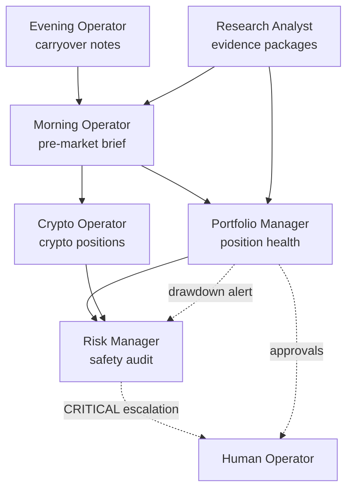

# Operator Guide

Trader Joe collaborates through six operator personas, each defined by
a `SKILL.md` playbook under `.traderjoe/skills/`. This guide summarises
the missions, allowed actions, and hand-offs — the authoritative
per-persona detail lives in each skill's own file.

Skills are read-only playbooks Claude Code loads when the operator
asks. None of the skills schedule work or automate transitions on
their own. See [`.traderjoe/skills/README.md`](../../.traderjoe/skills/README.md)
for discovery rules.

## The six personas

### 1. Morning Operator

**Slug:** `.traderjoe/skills/morning-operator/SKILL.md`.

**Mission.** Brief Trader Joe before the U.S. equity market opens.
Produce a concise, actionable morning report covering market regime,
overnight risk, sector leadership, relative strength, market breadth,
and watchlist status. Flag actionable setups that meet the six-gate
buy rules. Never execute trades.

**Allowed actions.**

- Read from `strategy/market_regime.py`,
  `strategy/overnight_risk.py`, `strategy/sector_leadership.py`,
  `strategy/relative_strength.py`, `strategy/market_breadth.py`,
  `strategy/morning_intelligence.py`.
- Call `python trader.py --scan` or `python trader.py --morning` to
  run the scan pipeline.
- Call `python trader_cli.py positions`, `python trader_cli.py
  watch`, `python trader_cli.py trending`.
- Generate `reports/morning_report_YYYY-MM-DD.md`.
- Optionally run a warehouse-first six-month simulation via
  `scripts/traderjoe-simulate --strategy champion-v0.4.0 ... --window
  60d` for context.

**Forbidden actions.** Never places or approves orders. Never enables
feature flags. Never sets `PAPER=False`.

**Hand-offs.** Passes actionable setups to the operator for
`/trade-approve`; escalates risk anomalies to the Risk Manager;
consumes overnight notes from the Evening Operator.

### 2. Evening Operator

**Slug:** `.traderjoe/skills/evening-operator/SKILL.md`.

**Mission.** Post-market reconciliation. Runs the daily digest, trade
journaling, position reconciliation, and prepares tomorrow's brief.

**Allowed actions.**

- Call `python trader.py --eod` for end-of-day scan cleanup.
- Call `python scripts/generate_daily_digest.py` — pulls today's
  trades from `trades.db`, computes metrics, sends Telegram digest,
  saves markdown under `reports/daily_digest_YYYY-MM-DD.md`.
- Call `python trader_cli.py trades`, `python trader_cli.py report`.
- Update the journal in `research_notes/` with per-position exit
  reasons (`RSI overbought`, `MACD death cross`, `upper BB`,
  `six-gate failure`, `user decision`, `tanking timer`).
- Prepare tomorrow's briefing (carry-over notes to the Morning
  Operator).

**Forbidden actions.** Never places orders after the close. Never
enables feature flags.

**Hand-offs.** Feeds carry-over notes to the Morning Operator;
escalates portfolio-drawdown or single-position anomalies to the
Portfolio Manager and Risk Manager.

### 3. Research Analyst

**Slug:** `.traderjoe/skills/research-analyst/SKILL.md`.

**Mission.** Read-only backtests, walk-forward analysis, Champion vs
Challenger comparisons, produce evidence packages.

**Allowed actions.**

- Call `scripts/traderjoe-research plan|run|summarize`.
- Call `scripts/research-import-watchlist` to bootstrap warehouse
  data.
- Call `scripts/research-run-matrix` for multi-window analysis.
- Call `scripts/research-validate-offline --dataset-id X --start ...
  --end ...`.
- Call `scripts/research-regime-report` for regime-conditioned
  breakdowns.
- Call `scripts/traderjoe-simulate --strategy <key> ...` for
  portfolio-sized replay.
- Import `strategy/research_account.py`, `strategy/backtest_lab.py`,
  `strategy/comparison_harness.py`, `strategy/walk_forward.py`,
  `strategy/rs_challenger.py`, `strategy/research_reports.py`,
  `strategy/promotion_gates.py`, `strategy/lab/*`.
- Read the Research Alpaca account via `.env.research` credentials.
- Write to `reports/validation/`, `reports/lab/`,
  `reports/portfolio_simulations/`, `reports/research_summaries/`.
- File hypotheses in the hypothesis queue.
- Prepare promotion recommendation packages (never execute the
  promotion).

**Forbidden actions.** Never modifies `trader.py`, `crypto_trader.py`,
or `strategy/runner.py`. Never constructs an `ApprovalRecord`. Never
advances a `PromotionEntry` past `STATE_DISABLED`. Never sets
`PAPER=False`. Never places or approves an order. Only role allowed to
import `strategy.research_account`.

**Hand-offs.** Delivers evidence packages to the operator for
promotion decisions. Provides Champion baseline updates to the
Morning Operator when a new Champion version is minted.

### 4. Portfolio Manager

**Slug:** `.traderjoe/skills/portfolio-manager/SKILL.md`.

**Mission.** Track portfolio health: P&L, drawdown, sizing (0.5%
risk-per-trade default), concentration (>25% single position, >50%
sector), correlation, cross-operator coordination. Paper-only
operations.

**Allowed actions.**

- Call `python trader_cli.py positions`, `python trader_cli.py
  pending`, `python trader_cli.py report`.
- Read from `strategy/config.py` for `MAX_SECTOR_EXPOSURE`,
  `RISK_PER_TRADE_DEFAULT`, other portfolio-relevant constants.
- Run `scripts/traderjoe-simulate` for what-if analysis on
  hypothetical trades.
- Run `scripts/traderjoe-paper-execute --dry-run` to preview any
  simulator-generated plan before submission.
- Enforce hard caps (`MAX_POSITIONS=20`, `MAX_BUY_AMOUNT=25000` for
  equities; `MAX_POSITIONS=3`, `MAX_BUY_AMOUNT=8000` for crypto).
- Trigger emergency stops via `/etc/traderjoe/STOP_*` files when
  portfolio-level anomalies breach thresholds.

**Forbidden actions.** Never modifies the runner constants directly
(escalates to the operator instead). Never sets `PAPER=False`. Never
approves orders from the research surface.

**Escalation triggers.** Portfolio drawdown >5% from peak; any
single position >25% of equity; sector concentration >50%;
correlation >0.8 among top 3 positions.

**Hand-offs.** Coordinates with the Morning Operator on entries and
the Evening Operator on reconciliation; escalates portfolio-level
concerns to the Risk Manager.

### 5. Risk Manager

**Slug:** `.traderjoe/skills/risk-manager/SKILL.md`.

**Mission.** The system's guardian. Monitors and enforces every
safety rule, risk limit, and compliance check across the entire
Trader Joe system.

**Allowed actions.**

- Audit `trader.py:48` and `crypto_trader.py:62` for `PAPER = True`.
- Audit `.env.production` for emptiness.
- Audit `strategy/config.py::FeatureFlags` for all-disabled state
  (unless an explicit `ApprovalRecord` exists).
- Audit `strategy/promotion_gates.py::PromotionEntry` for
  consistency between `current_state` and evidence.
- Audit `.env.paper`, `.env.crypto`, `.env.research` credential
  isolation.
- Audit `.gitignore` for `.env.*` handling and `.env.example`
  whitelist entry.
- Audit `docs/systemd/*` for `traderjoe-production.service.example`
  remaining `.example` (not renamed).
- Own `/etc/traderjoe/STOP_EQUITY_PAPER` and
  `/etc/traderjoe/STOP_CRYPTO_PAPER` — creates them on demand.
- Read logs under `reports/paper_bridge/`,
  `reports/paper_daemon/{equity,crypto}/` for anomaly detection.

**Severity taxonomy.**

- **CRITICAL** — `PAPER=False`, live-runner touched by research,
  `.env.production` populated without ApprovalRecord.
- **HIGH** — Feature flag globally enabled without ApprovalRecord;
  promotion advanced without evidence.
- **MEDIUM** — Cap breached but daemon halted; drawdown alert.

**Forbidden actions.** Never modifies code to bypass a rule (fixes
the root cause). Never approves an order.

**Hand-offs.** Escalates CRITICAL findings to the operator
immediately; requires a human ApprovalRecord to unlock any safety
gate.

### 6. Crypto Operator

**Slug:** `.traderjoe/skills/crypto-operator/SKILL.md`.

**Mission.** Run crypto Elliott Wave scans via `crypto_trader.py`,
manage crypto paper positions, monitor crypto market conditions.
Coordinates crypto ↔ equity separation.

**Allowed actions.**

- Call `python crypto_trader.py --scan`.
- Call `scripts/traderjoe-crypto-paper-daemon --symbols BTC/USD
  ETH/USD SOL/USD` — plan-only by default.
- With explicit operator approval, run
  `scripts/traderjoe-crypto-paper-daemon ... --execute-paper-orders`
  when `PAPER_AUTO_EXECUTE_CRYPTO=true` is set in `.env.crypto`.
- Read from `.env.crypto` only.
- Manage the crypto tanking timer (5-minute default, mirror of
  equity's).
- Own crypto-specific caps (`MAX_POSITIONS=3`,
  `MAX_BUY_AMOUNT=8000`, `DEFAULT_BUY_AMOUNT=3000`).

**Forbidden actions.** Never touches the equity paper account
(`.env.paper`). Never touches production. Never mixes crypto and
equity positions in a single decision context.

**Hand-offs.** Reports to the Portfolio Manager for cross-asset
correlation; escalates emergency scenarios to the Risk Manager (who
owns `/etc/traderjoe/STOP_CRYPTO_PAPER`).

## Coordination model

The six personas are not siloed. Coordination follows a rough
dependency graph:

Every arrow labelled dotted is an escalation to a human; every
solid arrow is a documented hand-off between AI personas.

## Operator commands reference

### Scripts (`scripts/`)

| Script | Persona(s) | Purpose |
|---|---|---|
| `traderjoe-simulate` | Research Analyst, Portfolio Manager | Warehouse-first portfolio simulation; broker-free. |
| `traderjoe-paper-execute` | Research Analyst, Portfolio Manager | Paper-trading bridge for simulator plans; dry-run default; refuses `.env.production`. |
| `traderjoe-paper-daemon` | Portfolio Manager, Risk Manager | 15-minute equity paper daemon; plan-only unless `PAPER_AUTO_EXECUTE_EQUITIES=true` + `--execute-paper-orders`. |
| `traderjoe-crypto-paper-daemon` | Crypto Operator, Risk Manager | 24/7 crypto paper daemon; plan-only unless `PAPER_AUTO_EXECUTE_CRYPTO=true` + `--execute-paper-orders`. |
| `traderjoe-research` | Research Analyst | Operator research entry point (`plan | run | summarize`). |
| `research-import-watchlist` | Research Analyst | Populate warehouse from Research Alpaca. |
| `research-validate-offline` | Research Analyst | Historical validation from the warehouse. |
| `research-run-matrix` | Research Analyst | Offline validation across multiple windows. |
| `research-regime-report` | Research Analyst | Regime-conditioned breakdown of a matrix run. |
| `weekend-lab` | Research Analyst | One-shot Strategy Lab pipeline. |
| `run-paper` | Portfolio Manager, Morning/Evening Operator | Launches `trader.py` against `.env.paper`. |
| `run-crypto` | Crypto Operator | Launches `crypto_trader.py` against `.env.crypto`. |
| `run-research` | Research Analyst | Launches a research task against `.env.research`. |
| `generate_daily_digest.py` | Evening Operator | Daily digest to Telegram + Markdown. |
| `traderjoe_x_public_watch.py` | (background) | Watches public X profiles via `r.jina.ai` proxy. |

### `trader_cli.py` subcommands (all personas)

`positions`, `pending`, `approve <id>`, `reject <id>`, `buy <symbol>
[amount]`, `sell <symbol> [amount|all]`, `sell-all` / `sellall` /
`liquidate`, `keep <symbol>`, `watch <symbol>`, `scan`, `trending`,
`screener`, `report`, `list`.

Approvals are routed through `telegram_approvals.process_message`;
`pending` reads `pending_approvals` rows from `trades.db`; `trending`
reads `trending_watchlist.json`; `screener` invokes
`market_screener.run_screener()`.

## Safety invariants that bind every persona

From [`.traderjoe/skills/README.md`](../../.traderjoe/skills/README.md):

- **Paper only.** No persona flips `PAPER = False` or reads
  `.env.production`.
- **Account isolation.** Equity paper via `.env.paper`; crypto paper
  via `.env.crypto`; research via `.env.research`. Personas never
  cross accounts.
- **No auto-promotion.** A persona may propose a promotion transition
  but never constructs an `ApprovalRecord` or advances a
  `PromotionEntry` state on its own.
- **No feature-flag flipping.** Global `FeatureFlags` toggled only by
  an approved operator change.
- **Auto-execute is opt-in and doubly gated.** Env flag +
  `--execute-paper-orders` CLI flag both required.
- **Emergency stops honoured.** Personas check the relevant
  `/etc/traderjoe/STOP_*` file before recommending any execute path
  and treat its presence as a hard veto.

Full safety detail in [`safety-model.md`](safety-model.md).
