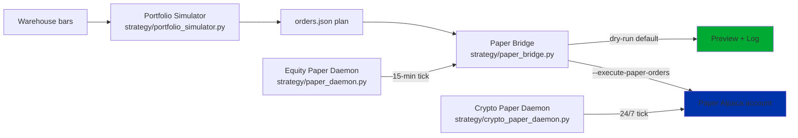

# Paper Trading

Trader Joe operates a layered paper-trading stack. Every layer is
dry-run by default; execution requires two independent decisions (env
flag + CLI flag) and refuses anything that looks like production.

This page documents the four components — Portfolio Simulator, Paper
Bridge, Equity Daemon, Crypto Daemon — plus the safety gates, logs,
reports, state files, and the expected daily workflow.

## Component overview



## Portfolio Simulator

**Files:** `strategy/portfolio_simulator.py`,
`strategy/portfolio_simulator_cli.py`,
`strategy/portfolio_simulator_main.py`,
`scripts/traderjoe-simulate`.

**Purpose.** Deterministically replay a strategy over a historical
window against a paper-sized cash ledger. Produces trades, an equity
curve, standard risk-adjusted metrics, and a proposed-orders plan.

**Non-goals.** The simulator does not talk to a broker. It refuses to
source any env file — it is warehouse-only by construction.

**Key classes.**

- `PortfolioSimulator` — the event-loop driver.
- `PortfolioSimulatorConfig` — knobs: `starting_cash`,
  `max_open_positions`, `max_dollars_per_trade`,
  `position_size_pct`, `commission_per_trade`, `slippage_bps`,
  `score_entry_threshold`, `score_exit_threshold`,
  `top_n_per_event`, `allow_short`, `allow_negative_cash`,
  `annual_trading_days`, `risk_free_rate`, `seed`.
- `PortfolioSimulationResult` — the outputs: `run_id` (`psim_<hash>`),
  `config_hash`, fills, trades, equity_curve, metrics,
  `proposed_orders`, `dataset_provenance`.
- `PortfolioMetrics` — starting_cash, ending_equity, net_pnl,
  total_return_pct, realized_pnl, unrealized_pnl, max_drawdown_pct,
  win_rate, average_hold_days, trade_count, winning_trades,
  losing_trades, CAGR, Sharpe, Sortino, Calmar, trading_days.

**CLI usage.**

```
./scripts/traderjoe-simulate \
  --strategy champion-v0.4.0 \
  --symbols AAPL MSFT NVDA SPY QQQ \
  --start 2026-01-05 --end 2026-07-04 \
  --starting-cash 100000
```

Or with a preset window:

```
./scripts/traderjoe-simulate \
  --strategy champion-v0.4.0 \
  --symbols AAPL MSFT NVDA SPY QQQ \
  --window 6mo --starting-cash 100000
```

Known strategies (from `KNOWN_STRATEGIES` in
`strategy/portfolio_simulator_cli.py`): `champion-v0.4.0`,
`champion-rs-v0.1.0`, `rs-challenger-v0.1.0`, `momentum-v0.1.0`,
`trend-v0.1.0`, `mean_reversion-v0.1.0`, `momentum_15m_v1`,
`opening_range_breakout_v1`, `rsi_mean_reversion_v1`,
`sector_rotation_daily_v1`, `volatility_regime_filter_v1`. Aliases
accepted (`momentum` → `momentum-v0.1.0`, etc.).

**Artifacts** (under `reports/portfolio_simulations/<run_id>/`):

- `report.md` — human-readable summary with headline metrics + trade
  blotter.
- `report.json` — machine-readable payload.
- `trades.csv` — round-trip blotter.
- `equity_curve.csv` — daily equity series.
- `orders.json` — proposed-plan artifact for the Paper Bridge.

**Determinism.**
`PortfolioSimulator._make_run_id` hashes the config hash + strategy
identity + symbols + window + event count. Two runs with the same
inputs produce the same `run_id`. Verified by
`tests/test_portfolio_simulator.py::TestSimulatorDeterminism`.

**Safety refusal.** The Python entry point
(`strategy/portfolio_simulator_main.py::_refuse_production_env`)
refuses:

- `HERMES_CONTEXT=production`.
- `PAPER` set to any false-y value.

The bash wrapper (`scripts/traderjoe-simulate`) refuses to source any
env file and sets `HERMES_CONTEXT=simulator` unless already set.

## Paper Bridge

**Files:** `strategy/paper_bridge.py`,
`strategy/paper_bridge_main.py`,
`scripts/traderjoe-paper-execute`.

**Purpose.** Consume a simulator (or research) plan and, in dry-run,
preview the resulting paper orders. With `--execute-paper-orders`,
submit them to the paper Alpaca account.

**Key classes.**

- `PaperBridgeConfig` — safety knobs: `execute` (default `False`),
  `symbol_allowlist`, `max_per_order_notional`
  (default `$5,000`), `max_total_notional` (default `$25,000`),
  `max_order_quantity` (default `500`), `env_file` (default
  `.env.paper`), `log_root` (default `reports/paper_bridge`).
- `PaperTradingBridge` — the runner.
- `PaperOrder` — one order after vetting: `symbol`, `side`,
  `quantity`, `reference_price`, `reference_notional`, `reason`,
  `accepted`, `rejection`.
- `PaperBridgeResult` — the tick result.

**CLI usage.**

Dry-run (safe default):

```
./scripts/traderjoe-paper-execute \
  --from-simulation reports/portfolio_simulations/<run_id>/orders.json \
  --dry-run
```

Actual paper submission:

```
./scripts/traderjoe-paper-execute \
  --from-simulation reports/portfolio_simulations/<run_id>/orders.json \
  --execute-paper-orders
```

**Config validation** (`paper_bridge.py:80-102`):

- Refuses `env_file` basename `.env.production`.
- Refuses `env_file` basename that doesn't start with `.env.paper`.
- Requires `max_per_order_notional ≤ max_total_notional`.

**Environment refusal** (`_refuse_production_env`):

- `HERMES_CONTEXT=production` → refuse.
- `PAPER` in `("false", "0", "no", "off")` → refuse.

**Endpoint validation** (`_resolve_endpoint`):

- Reads `PAPER_ALPACA_ENDPOINT` then `ALPACA_ENDPOINT`.
- Refuses anything without `paper-api.alpaca.markets` in the URL.

**Lazy SDK import.** `alpaca.trading.client.TradingClient` is imported
only inside `_submit_orders` — dry-runs and tests never touch it. The
client is pinned to `paper=True` regardless of endpoint.

**UUID normalization.** As of commit `7a24af3`, `broker_order_id` is
stringified at capture time (Alpaca's `Order.id` is a `uuid.UUID`,
which JSON cannot serialize natively). All `json.dump` calls in the
bridge use `default=str` as belt-and-suspenders.

## Equity Paper Daemon

**Files:** `strategy/paper_daemon.py`,
`strategy/paper_daemon_main.py`,
`scripts/traderjoe-paper-daemon`.

**Purpose.** 15-minute equity paper daemon. One tick per invocation.
Plan-only by default; auto-execute doubly-gated.

**Key classes.**

- `EquityPaperDaemonConfig` — knobs: `symbol_allowlist`,
  `strategy_key`, `interval` (default `"15Min"`), `execute` (default
  `False`), `max_per_order_notional` ($2,000), `max_total_daily_notional`
  ($10,000), `max_trades_per_day` (8), `cooldown_minutes` (60),
  `top_n_per_tick` (3), `env_file` (`.env.paper`),
  `emergency_stop_file` (`/etc/traderjoe/STOP_EQUITY_PAPER`),
  `state_file`, `log_root`, `plan_root`, `lookback_days` (20).
- `EquityPaperDaemon` — the tick runner.
- `DaemonState` — per-day persistent state: `current_day`,
  `trades_today`, `notional_today`, `last_order_iso_by_symbol`,
  `submitted_order_ids`.
- `DaemonTickResult` — the tick output.

**Auto-execute gate:**

- Env flag: `PAPER_AUTO_EXECUTE_EQUITIES=true` in `.env.paper`.
- CLI flag: `--execute-paper-orders` explicit in argv.

Both required. Either missing → dry-run with reason
`cli_execute_flag_not_set` or `PAPER_AUTO_EXECUTE_EQUITIES_not_true`.

**Emergency stop.** Presence of `/etc/traderjoe/STOP_EQUITY_PAPER`
short-circuits the tick with reason `emergency_stop_file_present`,
before any bars are loaded or the bridge is touched.

**Session gate.** `strategy/market_calendar.py::session_status(now)`
must return `is_regular_session=True`. Weekends, holidays, pre-market,
and post-market all short-circuit the tick.

**CLI usage.**

Plan-only (safe):

```
./scripts/traderjoe-paper-daemon \
  --symbols AAPL MSFT NVDA \
  --strategy momentum_15m_v1 \
  --interval 15Min
```

Auto-execute (after operator sets the env flag):

```
./scripts/traderjoe-paper-daemon \
  --symbols AAPL MSFT NVDA \
  --strategy momentum_15m_v1 \
  --interval 15Min \
  --execute-paper-orders
```

**Artifacts:**

- `reports/paper_daemon/equity/<tick_id>.log.json` — full tick result.
- `reports/paper_daemon/equity/plans/<tick_id>.json` — plan file (only
  if accepted orders were proposed).
- `reports/paper_daemon/equity_state.json` — persistent state file
  (per-day trade count, symbol cooldowns, submitted order id list).

**systemd:**

- Installable plan-only:
  - `docs/systemd/traderjoe-paper-plan.timer` — fires every 15
    minutes on weekdays.
  - `docs/systemd/traderjoe-paper-plan.service` — oneshot; runs the
    daemon with `--symbols AAPL MSFT NVDA SPY QQQ --strategy
    momentum_15m_v1 --interval 15Min` (no `--execute-paper-orders`).
- Uninstallable auto-execute template:
  - `docs/systemd/traderjoe-paper-daemon.service.example` —
    `ExecStart=/bin/false`, `[Install]` omitted,
    `ConditionPathExists=/etc/traderjoe/PAPER_AUTO_EXECUTE_APPROVED`.

## Crypto Paper Daemon

**Files:** `strategy/crypto_paper_daemon.py`,
`strategy/crypto_paper_daemon_main.py`,
`scripts/traderjoe-crypto-paper-daemon`.

**Purpose.** 24/7 crypto paper daemon. Never touches the equity paper
account.

**Key classes.**

- `CryptoPaperDaemonConfig` — similar shape to the equity config,
  with crypto-appropriate defaults: `max_per_order_notional`
  ($1,500), `max_total_daily_notional` ($4,500),
  `max_trades_per_day` (6), `cooldown_minutes` (60), `top_n_per_tick`
  (2), `env_file` (`.env.crypto`), `emergency_stop_file`
  (`/etc/traderjoe/STOP_CRYPTO_PAPER`).
- `CryptoPaperDaemon` — the tick runner.
- `CryptoDaemonState` — same fields as `DaemonState`.
- `CryptoDaemonTickResult` — the output.
- `default_crypto_bar_loader` — the default loader, using Alpaca's
  `CryptoHistoricalDataClient`.

**Auto-execute gate:**

- Env flag: `PAPER_AUTO_EXECUTE_CRYPTO=true` in `.env.crypto`.
- CLI flag: `--execute-paper-orders`.

**Emergency stop.** `/etc/traderjoe/STOP_CRYPTO_PAPER` short-circuits
the tick.

**No session gate.** Crypto trades 24/7; the daemon fires whenever it
is invoked.

**Env refusal:**

- Refuses `env_file` basename `.env.production`.
- Refuses `env_file` basename starting with `.env.paper` (must be
  `.env.crypto*`).
- Refuses `HERMES_CONTEXT=production` or false-y `PAPER`.

**Endpoint validation.** Reads `CRYPTO_ALPACA_ENDPOINT` (then
`ALPACA_ENDPOINT`). Refuses anything without `paper-api.alpaca.markets`.

**Credential isolation.** Reads only `CRYPTO_ALPACA_*` credentials.
The default bar loader (`default_crypto_bar_loader`) explicitly does
not fall back to `PAPER_ALPACA_*`, `ALPACA_*`, or
`PRODUCTION_ALPACA_*` — even for read-only data queries. See
`tests/test_new_strategies_and_daemons.py::TestDefaultCryptoBarLoader::test_refuses_paper_alpaca_credentials_only`.

**CLI usage.**

Plan-only:

```
./scripts/traderjoe-crypto-paper-daemon \
  --symbols BTC/USD ETH/USD SOL/USD
```

Auto-execute:

```
./scripts/traderjoe-crypto-paper-daemon \
  --symbols BTC/USD ETH/USD SOL/USD \
  --execute-paper-orders
```

**Artifacts:**

- `reports/paper_daemon/crypto/<tick_id>.log.json`.
- `reports/paper_daemon/crypto/plans/<tick_id>.json` (when orders
  proposed).
- `reports/paper_daemon/crypto_state.json`.

**systemd:**

- Uninstallable auto-execute template:
  - `docs/systemd/traderjoe-crypto-paper-daemon.service.example` —
    same `ExecStart=/bin/false` + `[Install]` omitted +
    `ConditionPathExists=/etc/traderjoe/CRYPTO_AUTO_EXECUTE_APPROVED`
    pattern.

## Safety gates (summary)

Every path in this stack passes through the same gates:

| Gate | Simulator | Bridge | Equity Daemon | Crypto Daemon |
|---|:---:|:---:|:---:|:---:|
| Refuse `HERMES_CONTEXT=production` | ✔ | ✔ | ✔ | ✔ |
| Refuse `PAPER=false` | ✔ | ✔ | ✔ | ✔ |
| Refuse `.env.production` | (no env) | ✔ | ✔ | ✔ |
| Refuse cross-namespace env | n/a | requires `.env.paper*` | requires `.env.paper*` | requires `.env.crypto*` |
| Refuse non-paper endpoint | n/a | ✔ | ✔ | ✔ |
| `--execute` CLI flag required | n/a | ✔ | ✔ | ✔ |
| Env auto-execute flag required | n/a | n/a | `PAPER_AUTO_EXECUTE_EQUITIES` | `PAPER_AUTO_EXECUTE_CRYPTO` |
| Emergency stop file | n/a | n/a | `/etc/traderjoe/STOP_EQUITY_PAPER` | `/etc/traderjoe/STOP_CRYPTO_PAPER` |
| Session gate | n/a | n/a | regular NYSE hours only | 24/7 |
| Per-order notional cap | ✔ | $5,000 default | $2,000 default | $1,500 default |
| Aggregate daily notional cap | n/a | $25,000 default | $10,000 default | $4,500 default |
| Trades-per-day cap | n/a | n/a | 8 | 6 |
| Cooldown per symbol | n/a | n/a | 60 min | 60 min |
| Duplicate-order protection | n/a | n/a | per-day state | per-day state |
| Symbol allowlist | n/a | ✔ | ✔ | ✔ |
| Log every decision | ✔ | ✔ | ✔ | ✔ |

## Logs

- `reports/paper_bridge/paper-bridge-<timestamp>.log.json` — Paper
  Bridge tick logs.
- `reports/paper_daemon/equity/<tick_id>.log.json` — Equity Daemon
  tick logs.
- `reports/paper_daemon/crypto/<tick_id>.log.json` — Crypto Daemon
  tick logs.

Every log is valid JSON. UUIDs (Alpaca `Order.id`) are stringified;
`json.dump` uses `default=str` as fallback.

## Reports

- `reports/portfolio_simulations/<run_id>/` — one folder per
  simulator run.
- `reports/paper_bridge/` — bridge tick logs.
- `reports/paper_daemon/equity/plans/` — equity daemon plan artifacts.
- `reports/paper_daemon/crypto/plans/` — crypto daemon plan artifacts.

## State files

- `reports/paper_daemon/equity_state.json` — equity daemon
  per-day state (persisted between ticks).
- `reports/paper_daemon/crypto_state.json` — crypto daemon
  per-day state.

State fields:

- `current_day: str` — ISO date; reset if the tick's day differs.
- `trades_today: int`.
- `notional_today: float`.
- `last_order_iso_by_symbol: Dict[str, str]` — last submission per
  symbol; used for cooldown enforcement.
- `submitted_order_ids: List[str]` — every symbol submitted today;
  used for duplicate protection.

Reset a state file by deleting it:

```
rm -f reports/paper_daemon/crypto_state.json
```

The next tick will treat the day as fresh.

## Expected daily workflow

### Morning (pre-market)

1. Morning Operator runs the observational scan.
2. Research Analyst optionally produces a fresh 6-month simulator
   run for context.
3. Portfolio Manager reviews the plan, if any.
4. Human approves via `python trader_cli.py approve <id>` or via
   Telegram.

### Regular session (09:30–16:00 ET)

5. `trader.py` runs the live equity paper scan (via
   `scripts/run-paper` or `traderjoe-paper.service`).
6. If enabled: equity paper daemon fires every 15 minutes via
   `traderjoe-paper-plan.timer` (plan-only) or the
   auto-execute variant (with human-approved env flag).

### Continuous

7. Crypto paper daemon can fire any time via
   `scripts/traderjoe-crypto-paper-daemon`. Cron or systemd handles
   the schedule.

### Evening (post-market)

8. Evening Operator runs `scripts/generate_daily_digest.py`.
9. Trades are journaled with exit reasons.
10. Anomalies filed for the Research Analyst.

### If things go wrong

Emergency stops halt the paper daemons immediately:

```
# Equity paper daemon
touch /etc/traderjoe/STOP_EQUITY_PAPER

# Crypto paper daemon
touch /etc/traderjoe/STOP_CRYPTO_PAPER

# Live paper runner
sudo systemctl stop traderjoe-paper.service

# Live crypto runner
sudo systemctl stop traderjoe-crypto.service
```

The daemons check for the stop file every tick; the runners
respond to systemd.
