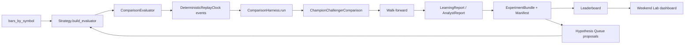

# Strategy Laboratory

The Strategy Laboratory turns hypotheses into evidence. It sits on top
of the Backtest Lab primitives (`strategy/backtest_lab.py`,
`strategy/comparison_harness.py`, `strategy/walk_forward.py`,
`strategy/champion_scoring.py`) and produces artifacts a human — or a
Research Analyst persona — can rank, compare, and act on.

Every Lab module is deterministic, read-only, and refuses to touch a
live path or a credential env.

## Strategy interface

**File:** `strategy/lab/strategy.py`.

Public surface:

- `Strategy` — a runtime-checkable Protocol (line 91).
- `StrategyBase` — convenience base class (line 170) subclasses
  override `parameters()`, `required_history()`, `build_evaluator()`.
- `StrategyIdentity` — frozen dataclass (line 70) carrying `name`,
  `version`, `parameters`, `stable_hash`.
- `stable_parameter_hash(name, version, parameters) → str` —
  SHA-256 over JSON-canonicalized payload, deterministic and
  insertion-order insensitive (line 37).

Concrete strategies must (per the Protocol docstring):

1. Be deterministic given the same `bars_by_symbol` and event
   sequence.
2. Not read env vars, open network sockets, or open write file
   handles.
3. Not enable feature flags, mutate `PromotionEntry`, or build an
   `ApprovalRecord`.

The default `StrategyBase.score` / `.explain` / `.identity` /
`.stable_hash` implementations delegate to `parameters()`,
`required_history()`, and `build_evaluator()` — so most subclasses
only override those three.

## Registry

**File:** `strategy/lab/registry.py`.

Auto-discovers every `StrategyBase` subclass under
`strategy/lab/*.py` and makes them addressable by their `name` class
attribute.

- `StrategyRegistry` (line 80) — thread-safe (`threading.Lock`),
  idempotent (same class + same name is a no-op; a *different*
  class under an existing name raises `RegistryConflictError`).
- `discover(package="strategy.lab", skip_modules=None)` (line 158) —
  walks `pkgutil.iter_modules`, imports each module, registers every
  attribute that:
  - is a `StrategyBase` subclass,
  - has a non-empty `name`,
  - has `__module__ == module_name` (avoids re-exports).
- Skipped modules: `__init__`, `registry`, `strategy`,
  `single_factor`, `experiment_runner`.
- `get_default_registry()` (line 205), `register(cls)` decorator
  (line 209), `discover_strategies(package, registry)` (line 215).

**Adding a strategy:** drop `strategy/lab/<slug>.py` with a
`StrategyBase` subclass carrying a non-empty `name` — it auto-registers
the next time `discover_strategies()` runs. No registration file to
edit.

## Backtest Lab primitives

**File:** `strategy/backtest_lab.py`.

- `BacktestConfig` — frozen dataclass with `dataset_id`, `strategy_id`,
  `start_date`, `end_date`, `symbols`, `benchmarks`, `initial_cash`,
  `fee_bps`, `slippage_bps`, `seed`, `output_dir`, `metadata`.
- `BacktestEvent` — timestamped event: `timestamp`, `event_type`,
  `payload`, `sequence`.
- `DeterministicReplayClock` — sorts by `(timestamp, sequence,
  event_type)` (line 223).
- `StrategyEvaluation` — the per-event output: `scores`,
  `rankings`, `explanations`, `warnings`, `structured_explanations`
  (line 249).
- `stable_json`, `stable_hash` — canonical JSON and SHA-256 (`_canonicalize`
  walker at line 26).

## Comparison harness

**File:** `strategy/comparison_harness.py`.

- `ComparisonEvaluator` — Protocol for anything with a `strategy_id`
  and `.evaluate(event) -> StrategyEvaluation`.
- `ScoreRow` — aligned Champion + Challenger view of one symbol at
  one event.
- `DisagreementRecord` — classifies each divergence as
  `ranking_only`, `entry_selection`, `score_delta`, or
  `data_unavailable`.
- `ChampionChallengerComparison` — the container the harness returns.
- `ComparisonHarness.run(clock, dataset_id, seed)` — the main entry
  point.

## Walk forward

**File:** `strategy/walk_forward.py`.

- `WalkForwardPipeline` — orchestrates in-sample / out-of-sample
  cross-validation windows.
- `generate_walk_forward_schedule(...)` — builds the window
  sequence.
- `WalkForwardReport` — the result.

Default cadence in `strategy/historical_validation.py`:
`in_sample_days=30`, `out_of_sample_days=15`, `step_days=15`.

## Experiment runner

**File:** `strategy/lab/experiment_runner.py`.

- `run_strategy_experiment(config, strategy, ...)` (line 139) —
  replays a `HistoricalValidationConfig` with the *challenger* slot
  replaced by the injected `Strategy`. Champion stays as the
  baseline.
- `ExperimentBundle` (frozen, line 99) — the artifact bundle.
- `ExperimentManifest` (frozen, line 46) — metadata for the run.
- `experiment_id` format: `exp_{dataset_id}_{strategy_name}_{stable_hash[:12]}`
  (line 174).

**Invariants:** identical inputs yield identical outputs. Never
enables feature flags. Never constructs an `ApprovalRecord`.
`promotion_entry.current_state` stays `"disabled"` (docstring lines
158-160). `ChampionRelativeStrengthStrategy` is auto-detected in
`_make_challenger_factory` (line 130) and given `rs_provider` +
`flags` kwargs.

## Parameter sweeps

**File:** `strategy/lab/parameter_sweep.py`.

- `ParameterGrid` (frozen, line 52) — axes are sorted alphabetically,
  values are enumerated in caller insertion order (`:79`). An empty
  grid yields one empty combo.
- `SweepRow` (line 98) — one row per Cartesian combo.
- `SweepManifest` (line 126) — aggregate metadata.
- `run_parameter_sweep(strategy_factory, grid, config, ...)` (line
  171) — runs one experiment per combo.

**Failure isolation:** `isolate_failures=True` by default — a failed
combo becomes a `SweepRow(error=...)` and the sweep continues (line
217). Per-row manifests land under `<manifest_root>/<sweep_id>/rows/`;
the aggregate under `<sweep_id>/sweep.json`.

## Leaderboard

**File:** `strategy/lab/leaderboard.py`.

- `LeaderboardEntry` (line 36) — one strategy's row.
- `Leaderboard` (line 91) — the ranked collection.
- `compute_score_metrics(bundle)` (line 153) — score-side metrics:
  `total_events`, `total_disagreements`, `disagreement_rate`,
  `mean_score_delta`, `max_abs_score_delta`,
  `selection_agreement_rate`.
- `entry_from_bundle(bundle, equity_metrics)` (line 209) — combines
  score-side + equity-side metrics into a `LeaderboardEntry`.
- `rank_leaderboard(entries, primary_metric, ...)` (line 279) —
  direction-aware sort.
- `write_leaderboard(leaderboard, output_dir)` (line 295) — persists.

Defaults: `DEFAULT_PRIMARY_METRIC = "sharpe"`,
`DEFAULT_TIEBREAK_METRIC = "mean_score_delta"`.

Sort direction depends on the metric (`_sort_key_for`, line 252):

- Higher-is-better: `sharpe`, `sortino`, `calmar`, `cagr`,
  `win_rate`, `profit_factor`, `selection_agreement_rate`.
- Lower-is-better: `max_drawdown`, `disagreement_rate`,
  `mean_score_delta`, `max_abs_score_delta`.
- `None` / NaN entries sink to the tail.

## Weekend Lab

**File:** `strategy/lab/weekend_lab.py`.

- `run_weekend_lab(...)` (line 340) — single-command orchestrator:
  (optional warehouse import →) strategy matrix → parameter sweeps
  → leaderboard → weekend manifest → HTML dashboard.
- `WeekendLabManifest` (line 82) — the manifest.
- `SweepSpec` (line 74) — a sweep declaration.
- `build_config(...)` (line 128).
- `render_dashboard_html(...)` (line 270).
- `main(argv)` (line 515).

Defaults: `DEFAULT_LAB_ROOT = "reports/weekend_lab"`,
`DEFAULT_SYMBOLS = ("AAPL","MSFT","NVDA")`, `DEFAULT_BENCHMARKS =
("SPY","QQQ")`.

Default sweeps (line 477):
- `momentum × {lookback: [10, 15, 20, 30]}`
- `champion_rs × {overlay_weight: [0.05, 0.10, 0.15, 0.20, 0.25]}`

**Invariants:** never touches a live path, never enables a feature
flag, never advances `PromotionEntry`, never constructs an
`ApprovalRecord`. Records `feature_flags_all_disabled` from
`get_feature_flags()`. Per-strategy failures are isolated.

## Hypothesis queue

**File:** `strategy/lab/hypothesis_queue.py`.

- `HypothesisQueue` (line 182) — JSONL-backed inbox under
  `reports/hypothesis_queue/*.jsonl`.
- `ExperimentProposal` (line 94) — the proposal record.
- `compute_proposal_id(title, strategy_name, params)` (line 59) —
  `hyp_` + SHA-256[:16] over `{title.lower, strategy_name.lower,
  suggested_parameters}`. `motivation`, `confidence`, `source` do
  NOT influence the id.
- Statuses: `STATUS_PROPOSED`, `STATUS_APPROVED`, `STATUS_REJECTED`,
  `STATUS_QUEUED`, `STATUS_ARCHIVED` (lines 32-36).

**Invariants:**

- Idempotent — proposing the same identity block twice returns the
  existing record.
- Atomic writes via temp file + rename.
- Approving a proposal is a *research signal only* — it never
  advances a `PromotionEntry` (docstring lines 15-17).

## Natural-language planner

**File:** `strategy/lab/nl_planner.py`.

- `plan_from_question(question) -> ResearchPlan` (line 446).
- `ResearchPlan` (line 85) — the plan.
- Kind constants: `KIND_RS_WEIGHT_SWEEP`, `KIND_REGIME_ANALYSIS`,
  `KIND_STRATEGY_COMPARISON`, `KIND_UNRECOGNISED`.
- `main(argv)` (line 515) — CLI.

**Invariant:** rule-based regex parser, not LLM-driven. Same
question always produces the same plan. Only `generated_at` is
non-deterministic. Unmatched questions produce `unrecognised` with
warnings listing supported kinds — never a silent guess. CLI exits
`3` for `unrecognised`.

## Dashboard backend

**File:** `strategy/lab/dashboard_backend.py`.

Read-only JSON API over the artifact tree from Cards 1-7 + 9.

Endpoints (all return `{"data", "warnings", "generated_at"}`
envelope):

- `list_weekend_runs`, `latest_weekend_run`, `weekend_run_detail`
- `leaderboard`, `latest_leaderboard`
- `list_experiments`, `experiment_detail`
- `strategy_rankings`, `top_parameter_sets`
- `analyst_summaries`
- `dataset_provenance`, `warehouse_status`
- `hypothesis_queue`

Collected in the `ENDPOINTS` mapping (line 402). Constants
`DEFAULT_LIMIT = 50`, `MAX_LIMIT = 500`.

**Invariants:** no mutations. Deterministic given a fixed on-disk
tree. Missing artifacts return `{"error": "not_found", "message":
...}`. `_load_json_safe` returns `None` on missing / malformed JSON
so a single bad manifest never crashes a listing.

## Performance metrics

**File:** `strategy/lab/performance_metrics.py`.

- `compute_performance_metrics(bundle, bars_by_symbol,
  side="challenger")` (line 322).
- `PerformanceMetrics` (line 43) — the result: CAGR, annualised
  return, Sharpe, Sortino, Calmar, MaxDrawdown, UlcerIndex, win rate,
  avg gain, avg loss, profit factor, exposure, turnover, num_events,
  num_holding_periods, num_trades, final_equity.
- `build_equity_curve(bundle, bars_by_symbol, side)` (line 159).
- `HoldingPeriod` (line 145).
- `TRADING_DAYS_PER_YEAR = 252`.

**Model:** at every replay event, the top-ranked symbol (rank==1) is
held until the next event; cash otherwise. Equity starts at `1.0`,
compounds by `(1 + period_return)` per holding period.

**Guards:** NaNs → `0.0`. `profit_factor` keeps `math.inf` when wins
with zero losses so the corner case is visible.

## Regime tagger

**File:** `strategy/lab/regime_tagger.py`.

- `RegimeSpec` (line 68) — factory classmethods `quantile`,
  `ratio_quantile`, `sma_trend`, `threshold`.
- Modes: `MODE_QUANTILE`, `MODE_RATIO_QUANTILE`, `MODE_SMA_TREND`,
  `MODE_THRESHOLD`.
- Defaults: `DEFAULT_QUANTILES = (1/3, 2/3)`.

Tagging behaviour per mode:

- `quantile` — empirical terciles by default.
- `ratio_quantile` — quantiles of `numerator / denominator`.
- `sma_trend` — `up` / `down` vs `SMA(period)`.
- `threshold` — `above` / `below` a cutoff.

**Invariants:** deterministic given warehouse contents. Missing
bar → label `None`; `None`-labeled rows excluded from buckets and
reported as `unknown_count`. `sma_period >= 2`; quantiles strictly
ascending in `(0,1)`; `len(labels) == len(quantiles) + 1`.

## Multi-year matrix

**File:** `strategy/lab/multi_year_matrix.py`.

- `run_multi_year_matrix(...)` (line 211) — every registered
  strategy across every declared window.
- `MatrixWindow` (line 75), `ReportCardCell` (line 93),
  `StrategyReportCard` (line 119), `MultiYearMatrixManifest` (line
  139), `build_default_windows(...)` (line 178).
- `DEFAULT_YEARS = (2020, 2021, 2022, 2023, 2024, 2025, 2026)`.
- `DEFAULT_MATRIX_ROOT = "reports/multi_year_matrix"`.
- `DEFAULT_REGIMES` (line 61): `COVID_crash`, `COVID_recovery`,
  `Bull_2020_Q4`, `Bear_2022`, `Sideways_2023H1`, `Rally_2023H2`.

Failure isolation per `(strategy, window)` cell. Truncates the
current calendar-year window at `today`. Skips regime windows whose
start is in the future.

## Operator entry point — `traderjoe-research`

**File:** `strategy/lab/traderjoe_research.py`.

CLI `traderjoe-research` with subcommands:

- `plan "<question>"` — invokes `nl_planner.plan_from_question`.
- `run <plan-file>` — dispatches on plan `kind`:
  - `rs_weight_sweep` — writes a "documented" run manifest
    pointing to the canonical sweep report.
  - `regime_analysis` — delegates to `strategy.lab.regime_report.main`.
  - `strategy_comparison` — documents the exact
    `scripts/research-run-matrix` invocation without auto-running.
- `summarize <run-id> | latest` — reads the manifest.

`main(argv)` (line 415). Defaults: `DEFAULT_PLAN_ROOT =
reports/research_plans`, `DEFAULT_RUN_ROOT = reports/research_runs`,
`DEFAULT_WAREHOUSE_ROOT = market_data`.

**Invariants:** warehouse-only unless `--allow-provider-fallback` is
passed AND `RESEARCH_ALPACA_*` env vars are present (line 187).
Never enables feature flags, never constructs `ApprovalRecord`,
never advances `PromotionEntry` past `disabled`.

## Experiment presets

**File:** `strategy/lab/presets.py`.

- `ExperimentPreset` (frozen dataclass, line 24).
- `PRESETS: Dict[str, ExperimentPreset]` (line 58).
- `get_preset(name)`, `list_presets()`.

Three bundled profiles:

| Preset | Asset class | Interval | Universe | Strategies |
|---|---|---|---|---|
| `daily_swing_watchlist` | equity | daily | AAPL, MSFT, NVDA, SPY, QQQ | champion, momentum, trend, rsi_mean_reversion, sector_rotation, volatility_regime_filter |
| `intraday_15m_watchlist` | equity | 15Min | AAPL, MSFT, NVDA, SPY, QQQ | momentum_15m, opening_range_breakout |
| `crypto_24x7_paper_research` | crypto | 1Hour | BTC/USD, ETH/USD, SOL/USD | momentum, trend, rsi_mean_reversion |

Each preset carries `default_window_preset`, optional
`simulator_overrides`, optional `sector_map`, `notes`, and a
`schedule` label (`manual` / `15m_regular_hours` / `24x7`).

**Invariants:** pure metadata. Presets never place orders, never load
env files, never talk to a broker.

## Single-factor scaffolding

**File:** `strategy/lab/single_factor.py`.

- `SingleFactorStrategy(StrategyBase)` (line 129) — subclasses
  override `score_symbol(bars, cutoff, symbol) -> (float,
  components_dict)`.
- `_SingleFactorEvaluator` (line 41) — walks each symbol at
  `event.timestamp`, calls `_bars_up_to(cutoff)`, invokes
  `score_symbol`, sorts by `(-score, symbol)`, packages the
  `StrategyEvaluation` with rankings + `ScoreExplanation`.
- Under-history behavior: emits a `blank_explanation` with note
  `"insufficient_history: have=N need>=M"` and drops the symbol.

Used by every non-Champion strategy adapter except
`SectorRotationDailyStrategy` (which needs its own evaluator to
consult the sector map).

## Interval requirements

**File:** `strategy/lab/interval_requirements.py`.

- Interval tuples: `DAILY_ONLY = (DAILY,)`, `INTRADAY_15M =
  (MINUTE_15,)`, `INTRADAY_ANY = (HOURLY, MINUTE_1, MINUTE_5,
  MINUTE_15, MINUTE_30)`, `DAILY_OR_INTRADAY = (DAILY, HOURLY,
  MINUTE_15, MINUTE_30)`.
- `IntervalMismatchError` — raised by `assert_supported_interval`.
- `assert_supported_interval(strategy_name, supported, requested)`
  (line 40) — called by strategy adapters in `build_evaluator` before
  any bars are scored.

## Data flow through the Lab

Every arrow is a pure function of its input. Every artifact carries a
stable hash. The dashboard reads what's on disk; the Lab writes what
it computed. No shared mutable state.
