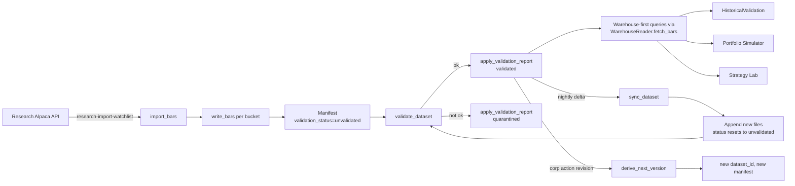

# Historical Warehouse

The Historical Data Warehouse is the authoritative research surface.
Every research and simulation module reads bars from the warehouse
first, and only falls through to a provider when explicitly opted in
by the caller.

The design goal (`docs/architecture/phase-5-6-historical-warehouse.md`):
*acquire once, validate once, store forever, research forever, sync
nightly, tolerate a provider vanishing.*

## Filesystem layout

Everything lives under a single root (default `market_data/`,
overridable via `WAREHOUSE_ROOT`):

```
market_data/
  equities/
    daily/<dataset_id>/<symbol>/<YYYY>.parquet
    hourly/<dataset_id>/<symbol>/<YYYY>-<MM>.parquet
    minute/<dataset_id>/<symbol>/<YYYY>-<MM>-<DD>.parquet
  crypto/     …
  options/    …
  manifests/<dataset_id>.json
  metadata/
  versions/<dataset_id>/<version>/…
  queue/<dataset_id>.db          # SQLite resume state
```

Time-bucket policy (`strategy/warehouse/parquet_io.py:221`):

- `daily` → `<YYYY>.parquet`
- `hourly` → `<YYYY>-<MM>.parquet`
- `minute` / `second` → `<YYYY>-<MM>-<DD>.parquet`

Layout invariants (`strategy/local_warehouse.py`):

- `WarehouseLayout` is a frozen dataclass; every path is derived, not
  configured (`local_warehouse.py:171`).
- `dataset_dir(dataset_id, asset_class, interval)` validates the id
  against path traversal via `_require_dataset_id`
  (`local_warehouse.py:283`, `:328`).
- `create()` is idempotent — safe to run at process start.
- `verify()` raises `WarehouseIntegrityError` listing missing subdirs.

Env: only `WAREHOUSE_*` variables. `WAREHOUSE_ROOT_ENV =
"WAREHOUSE_ROOT"`, `DEFAULT_WAREHOUSE_ROOT = "market_data"`
(`local_warehouse.py:59-60`).

## Parquet schema

Canonical 12-column schema (`strategy/warehouse/parquet_io.py:132`):

```
symbol             string, non-null
timestamp          string (ISO 8601), non-null
open               float64, non-null
high               float64, non-null
low                float64, non-null
close              float64, non-null
volume             float64, non-null
vwap               float64, nullable
trade_count        int64,  nullable
interval           string, non-null
adjustment_mode    string, non-null
adjustment_version string, non-null
```

Compression: Zstandard level 3, `use_dictionary=False`,
`write_statistics=False`. Fully deterministic on-disk output
(`parquet_io.py:381`).

Public writers/readers:

- `write_bars(layout, bars, asset_class, dataset_id="")` — atomic
  writes per bucket; returns a `List[WrittenFile]` with sha256,
  size, row_count (`parquet_io.py:413`).
- `read_bars(layout, relative_paths)` — validates on-disk schema
  against `CANONICAL_SCHEMA` before reading (`parquet_io.py:498`).
- `scan_parquet_files(layout, asset_class, interval, dataset_id="",
  symbol=None)` — deterministic path enumeration
  (`parquet_io.py:526`).

## Catalog

The catalog is the source of truth for what a dataset contains and
whether it may be trusted. Defined in `strategy/data_catalog.py`.

`DatasetFile` (`:184`):

```
path         (relative)
sha256
size_bytes
row_count?
schema
```

`DatasetManifest` (`:233`) — frozen dataclass with Phase 3 core
fields (`dataset_id`, `kind`, `description`, `source`, `symbols`,
`benchmarks`, `start_date`, `end_date`, `imported_at`, `version`,
`files`, `notes`, `metadata`) plus Phase 5.6 warehouse extension
(`:264-278`):

- `provider`, `provider_request_id`
- `interval`, `asset_class`
- `adjustment_mode`, `adjustment_version`, `corporate_action_version`
- `timezone`
- `validation_status`
- `parent_dataset_id`
- `provider_capabilities_snapshot`
- `warehouse_paths`

Legacy manifests round-trip byte-identically: warehouse extension
fields serialize only when populated (`data_catalog.py:354-376`).

`DataCatalog` (`:474`):

- `from_directory(root, manifests_subdir="manifests")` — loads every
  `<manifests>/*.json`.
- `from_warehouse_layout(layout)` — wrapper.
- `find_coverage(symbol, interval, start, end)` — every matching
  manifest.
- `gaps(symbol, interval, start, end)` — uncovered day-level
  sub-ranges between contiguous manifest windows.
- `latest_validated(symbol, interval)` — most recent
  `validation_status='validated'` manifest.
- `versions(dataset_id)` — v1 root plus everything with matching
  `parent_dataset_id`.
- `validate(dataset_id)` — light checks (file existence, size, sha256).
- `reproducibility_metadata(dataset_id)` — for run manifests.

Validation status vocabulary (`local_warehouse.py:100`):

```
unvalidated | validating | validated | quarantined
```

Only `validated` datasets are consumable by the WarehouseReader as a
warehouse hit; `unvalidated` and `quarantined` cause a fall-through
to the provider chain (if any).

## Validation

`strategy/warehouse/validation.py` is a pure function:

- `validate_dataset(layout, dataset_id) → ValidationReport` (`:180`).
  Never mutates the manifest.
- `apply_validation_report(layout, report)` (`:441`) — promotes to
  `validated` if `ok=True`, else `quarantined`; calls
  `write_manifest(..., force=True)`.

`ValidationReport` (`:115`): `ok`, `files_checked`, `rows_checked`,
`findings`, `generated_at`.

`ValidationFinding` (`:97`): `kind`, `severity ("error" | "warning")`,
`message`, `subject`.

**Invariants checked (`validation.py`):**

- Every declared `DatasetFile` exists on disk.
- sha256 and size match the manifest.
- Parquet schema matches `CANONICAL_SCHEMA`.
- Row count matches the manifest declaration.
- OHLCV invariants: `low <= high`, `open` and `close` in
  `[low, high]`, `volume >= 0`, no NaN.
- No duplicate `(symbol, timestamp)` across files (via `seen_keys`).
- Timestamps start with `YYYY-MM-DD` prefix.

Calendar alignment, DST, and corporate-action cross-checks are
explicitly out of scope for the validation card — separate versioning
and gap-detection modules cover those.

## Versioning

`strategy/warehouse/versioning.py`:

- `version_chain(catalog, dataset_id)` — ordered chain
  (root → children) (`:195`).
- `parent_manifest(catalog, dataset_id)` — the parent's
  `DatasetManifest` or `None` (`:219`).
- `derive_next_version(parent_manifest, revision_source="",
  adjustment_version="", corporate_action_version="")` — produces a
  payload with a new `dataset_id` (appends or increments a `-vN`
  suffix), inherits fields, resets `validation_status` to
  `unvalidated`, and clears `files`. Never mutates the parent
  (`:243`).
- `compare_versions(layout, catalog, parent_dataset_id,
  child_dataset_id)` — keys by `(symbol, timestamp)`, categorizes
  rows as `added / removed / changed` (`:344`).
- `refuse_if_validated(layout, dataset_id)` — the guardrail preventing
  in-place mutation of a validated manifest (`:440`).

`BarDiff` kinds (`:104`): `added | removed | changed`. `VersionDiff`
carries the diff plus counters (`:135`).

**Invariant:** a `validated` manifest is immutable. Any change goes
through `derive_next_version(...)` and produces a new dataset id.

## DuckDB query surface

`strategy/warehouse/duckdb_query.py` provides SQL-backed range
scans. `WarehouseQueryReader` (`:140`) opens an embedded
`duckdb.connect(":memory:")` unless a persistent `db_path` is
supplied.

Public methods (all take `AssetClass, BarInterval, dataset_id=""`
and re-scan Parquet via `read_parquet(?, union_by_name=true)`):

- `scan_bars(asset_class, interval, symbols, start, end,
  dataset_id="")` — range scan returning `List[Bar]` sorted by
  `(symbol, timestamp)` (`:182`).
- `coverage_summary(asset_class, interval, dataset_id)` — returns
  `CoverageSummary` with `first_timestamp`, `last_timestamp`,
  `row_count`, `file_count`, `symbols` (`:219`).
- `latest_bar(asset_class, interval, symbol, dataset_id="")`
  (`:255`).
- `row_counts_by_symbol(...)` (`:281`).
- `ohlcv_aggregate(...)` — returns `OHLCVAggregate` with `min_low`,
  `max_high`, `mean_close`, `mean_volume`, `total_volume` (`:308`).

Convenience: `open_reader(layout, db_path=None)` is a
`@contextmanager` (`:442`).

**Why DuckDB?** SQL over Parquet without loading everything into
Python memory, with predictable performance across dataset sizes.
Chosen after evaluation of pure Python, Polars, and SQLite paths
in the Phase 5.6 design doc.

## Gap detection

`strategy/warehouse/gap_detection.py::detect_gaps(...)` (`:166`)
returns a `GapReport`. Gap kinds:

- `missing_trading_day` — expected calendar day, zero bars.
- `missing_symbol` — expected symbol absent from the manifest.
- `partial_day` — sub-daily interval with fewer bars than expected.
- `holiday_bars_present` — bars found on a declared holiday.
- `weekend_bars_present` — bars found on a weekend when
  `exclude_weekends=True`.
- `no_coverage` — symbol has zero bars in the window.

Algorithm summary:

1. Load manifest → interval, asset_class, expected symbols.
2. Enumerate Parquet files; count bars per `(symbol, day)`.
3. Build `expected_days` — either a caller-supplied
   `Sequence[CalendarDay]` (holidays flagged) or a `_daterange`
   filter that skips weekends when `exclude_weekends=True`.
4. Per symbol, compare observed vs expected; emit gaps.
5. Deterministic sort `(symbol, date, kind)`.
6. Write via `write_report(...)`.

Reports live under `reports/warehouse_gaps/` (default).

## Research cache — the warehouse-first chain

`strategy/warehouse/research_cache.py::WarehouseReader` (`:103`) is
the primary consumer surface. Priority chain (fixed):

1. **Local warehouse** (`_try_warehouse` at `:257`).
2. **Provider plugins** — caller-supplied ordered tuple.
3. **Manual / CSV / Parquet importers** — at the tail of the plugin
   list.

Sources (`:59`): `SOURCE_WAREHOUSE = "warehouse"`, `SOURCE_PROVIDER =
"provider"`, `SOURCE_MANUAL = "manual"`.

Public methods:

- `has_complete_coverage(asset_class, interval, symbols, start,
  end)` — True iff every symbol has a catalog manifest that (a)
  matches asset_class + interval, (b) covers the window (`:157`).
- `fetch_bars(asset_class, interval, symbols, start, end,
  adjustment=RAW)` — returns a `CacheHit` (`:197`). Raises
  `ResearchCacheError` if no source in the chain returns data.
- `_resolve_manifest(symbol, interval, start, end)` — pin-first
  (`self._pinned_versions`), then `catalog.latest_validated`, then
  any covering manifest (`:318`).

**"Warehouse-first" is provable.** The Phase 5.6 test suite includes a
counter-based stub of `ResearchAccountClient.fetch_bars` and asserts
the counter stays at zero when warehouse coverage is complete
(`tests/test_research_cache.py`).

Scan window widens `T00:00:00+00:00` / `T23:59:59+00:00` when
start/end are date-only, accommodating TZ suffixes in stored
timestamps (`:288`).

## Dataset provenance

The `HistoricalValidation` and `PortfolioSimulator` orchestrators
record dataset provenance in their reports:

- `strategy/historical_validation.py::HistoricalValidationBundle` has
  a `dataset_provenance` field carrying the datasets used.
- `strategy/portfolio_simulator.py::PortfolioSimulationResult` has a
  `dataset_provenance` field (default `{"source": "warehouse",
  "warehouse_root": <root>, "datasets": [...]}`).

Provenance flows through the report writer and is echoed in the
Markdown report so operators can audit which manifest a result came
from.

## Import pipeline

`strategy/warehouse/import_pipeline.py`:

- `DEFAULT_CHUNK_SIZE = 50` (`:66`).
- Queue statuses `pending | inflight | done | failed`
  (`:73`).
- `PendingDownloadsQueue` (`:139`) — SQLite-backed resumability
  table with primary key `(dataset_id, symbol, window_start,
  window_end)`. Methods: `enqueue`, `pending(dataset_id)`,
  `mark(...)`, `status(...)`.
- `import_bars(layout, provider, dataset_id, symbols, start, end,
  asset_class, interval, adjustment=RAW, chunk_size=50, queue=None,
  force=False)` (`:275`) — chunks symbols; for each chunk marks
  queue INFLIGHT → fetches → `write_bars` → marks DONE. Builds a
  manifest via `_build_manifest_from_written` (`:393`) tagged
  `validation_status=STATUS_UNVALIDATED`. Returns an
  `ImportReport`.
- `rebuild_manifest(layout, dataset_id, asset_class, interval,
  adjustment=RAW, provider_name="operator", force=False)` (`:449`) —
  scans on-disk Parquet, recomputes sha256/size/row_count, writes a
  fresh unvalidated manifest.

**Resumability:** interrupt the import at any point; the queue
survives the process. Re-running skips already-`DONE` chunks and
picks up `PENDING` or `INFLIGHT` ones.

## Incremental sync

`strategy/warehouse/incremental_sync.py`:

- `sync_dataset(layout, dataset_id, policy, ledger=None)` (`:257`) —
  append-only delta sync.
- `sync_all(...)` (`:460`) — wrapper.
- Records: `ProviderCall` (`:74`), `SyncReport` (`:94`),
  `ProviderLedger` (`:133`) counting `calls: Dict[str,int]` and
  `bars: Dict[str,int]` per provider name.
- `SyncPolicy` (frozen, `:163`): `providers` (priority ordered),
  optional `dry_run`, `end` (empty → `now`).

Algorithm:

1. Load manifest, require `interval` and `asset_class`.
2. `_latest_timestamp` scans partition files for max timestamp
   (`:214`).
3. **If manifest is `validated` and not `dry_run`**, refuse to touch
   it: append a warning ("Use warehouse-revise for corporate-action
   revisions") and return a zero-change report (`:309`).
4. Iterate providers by policy priority; call
   `fetch_daily_bars` or `fetch_intraday_bars`; filter
   `b.timestamp > latest_before`; first provider with non-empty bars
   wins (`:332`).
5. On live run: `write_bars` (new time-bucketed files; never
   overwrite by design), then `_append_to_manifest` (`:422`) merges
   the file entries by path, bumps `end_date`, and resets the
   status to `unvalidated` (so validation must re-run).

## Operator bootstrap

`strategy/warehouse/operator/`:

- `import_watchlist.py` — module `strategy.warehouse.operator.import_watchlist`,
  program `research-import-watchlist`. Requires `RESEARCH_ALPACA_*`.
  Defaults: symbols `("AAPL","MSFT","NVDA","SPY","QQQ")`, start
  `2020-01-01`, interval `DAILY`, asset_class `EQUITY`, dataset id
  template `watchlist-{start}-{end}`, feed `sip`, chunk 50. Refuses
  `.env.production` explicitly. Skip-if-validated idempotency check.
  Runs `import_bars` under a `PendingDownloadsQueue(layout.root /
  "queue" / f"{dataset_id}.db")` and (unless `--skip-validate`) calls
  `validate_dataset` → `apply_validation_report`.
- `validate_offline.py` — program `research-validate-offline`.
  Required args `--dataset-id`, `--start`, `--end`. Default symbols
  `("AAPL","MSFT","NVDA")`, benchmarks `("SPY","QQQ")`. Constructs
  `WarehouseReader(layout)`; calls `has_complete_coverage`. Without
  `--allow-provider-fallback`, strips `RESEARCH_ALPACA_*` from env
  and refuses to proceed. Delegates to `run_historical_validation`.
- `run_matrix.py` — program `research-run-matrix`. Windows resolved
  via `resolve_window(label, today)` supporting `NNd`, `NNmo`, `NNy`,
  `ytd`, `<start>..<end>`. Default windows
  `("60d","90d","6mo","1y","ytd")`. For each window builds an
  `argparse.Namespace` and invokes `validate_offline.run`, catches
  per-window failures, writes a `ResearchRunManifest`. Emits a
  `MatrixSummary`.

Shell wrappers `scripts/traderjoe-research`,
`scripts/research-import-watchlist`,
`scripts/research-validate-offline`,
`scripts/research-run-matrix`, `scripts/research-regime-report`
all: (a) set `HERMES_CONTEXT="research"`, (b) source `.env.research`
by default, (c) explicitly refuse `.env` and `.env.production`.

## Lifecycle



## Known limitations (milestone tag)

Live inventory of `market_data/equities/`:

- `daily/` — six datasets present:
  `watchlist-2020-01-01-2026-07-04`, `regime-pack-2016`,
  `megacap-2016`, `sectors-2016`, `market-context-2016`, `core-2016`.
- `hourly/` — **empty**.
- `minute/` — **empty**.
- `crypto/`, `options/`, `metadata/`, `versions/` — present but
  empty.
- `manifests/` — six JSON files corresponding to the daily datasets.
- `queue/` — six SQLite DBs, one per dataset.

Consequences:

- Intraday equity strategies (`momentum_15m_v1`,
  `opening_range_breakout_v1`) will hit `ResearchCacheError` from the
  simulator until 15-minute equity data lands. Their supported
  intervals declare this refusal up-front.
- The crypto research preset relies on live data from the crypto
  paper API rather than a warehouse hit.
